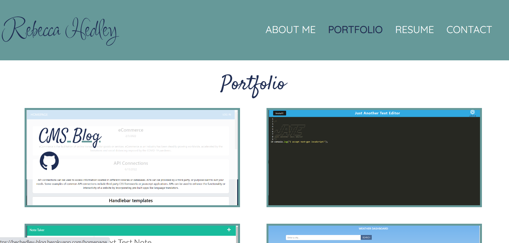
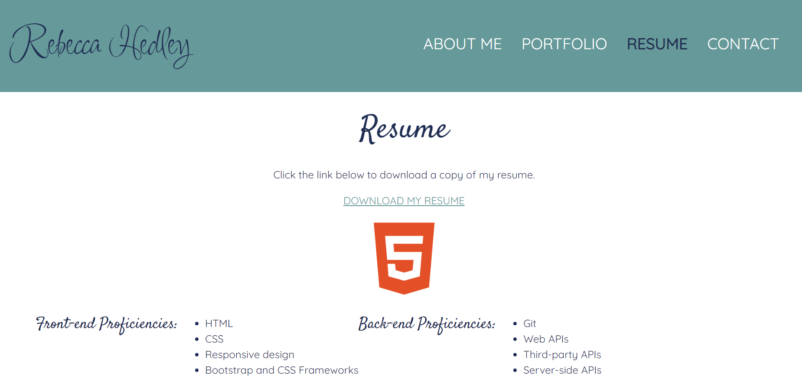

# Week 20: React Profile Page

## Description

This profile page is built using React to showcase my portfolio, resume and projects.

## Installation

N/A

## Usage

Click through the profile pages to view information about me, a showcase of my recent projects, a downloadable link to my resume, and a contact page to get in touch. Click the name of any project in the portfolio to be taken to the deployed URL of that project, or click the Github icon to open a new tab to that project's repo.

Deployed URL: (#)

## Credits

The following resources were referenced to ensure best practice and adherence to appropriate conventions:

'Deploying a Create React App to GitHub' by Create React App: (https://create-react-app.dev/docs/deployment/#github-pages)

Google Fonts: (https://fonts.google.com/)

Bootstrap CSS Documentation: (https://getbootstrap.com/docs/5.2/getting-started/introduction/)

'How to Link an Image in React' by Coding Beauty: (https://codingbeautydev.com/blog/react-link-image/#:~:text=To%20link%20a%20local%20image,prop%20of%20an%20img%20element.&text=Linking%20and%20displaying%20an%20image,tool%20like%20Create%20React%20App.)

'The difference between onBlur vs onChange for React text inputs' by Linguine Code: (https://linguinecode.com/post/onblur-vs-onchange-react-text-inputs)

'Regular Expression - Only first character check non-letter characters' via Stack Overflow, answer by Trenton Trama: (https://stackoverflow.com/questions/19821572/regular-expression-only-first-character-check-non-letter-characters)

'How to download a local file in Reactjs via Stack Overflow', answer by Belhadjer Samir: (https://stackoverflow.com/questions/66198311/how-to-download-a-local-file-in-reactjs)

Icons for technology proficiencies gif via Simple Icons: (https://simpleicons.org/)

'How to Set a Background Image in React From Your /src Folder' by Free Code Camp: (https://www.freecodecamp.org/news/react-background-image-tutorial-how-to-set-backgroundimage-with-inline-css-style/)

'Setting a backgroundImage With React Inline Styles' via Stack Overflow, answer by Pavindu and Hitesh Sahu: (https://stackoverflow.com/questions/39195687/setting-a-backgroundimage-with-react-inline-styles)

Common js functions and parameters, for loops and arrays: JS CheatSheet by HTML CheatSheet (https://htmlcheatsheet.com/js/)

## License

Licensed under the standard MIT license. Please refer to the license in the repo for more information.
